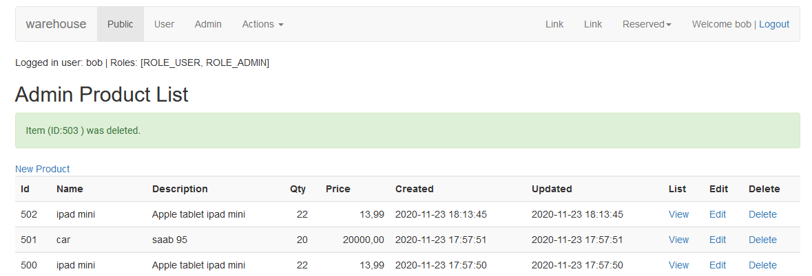
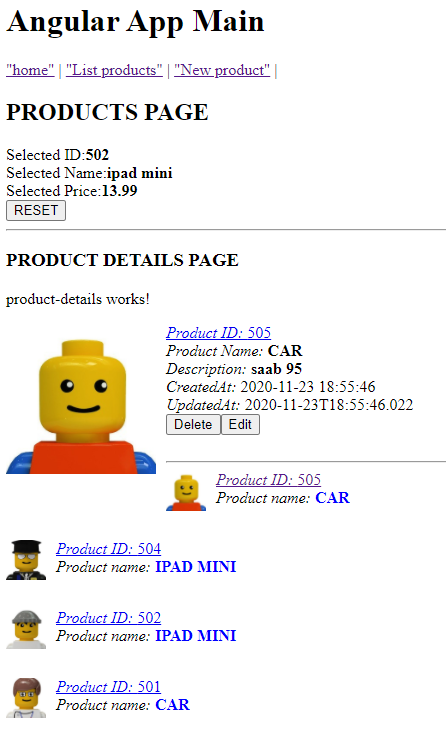
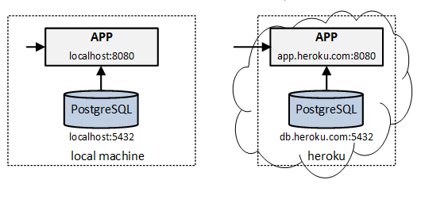
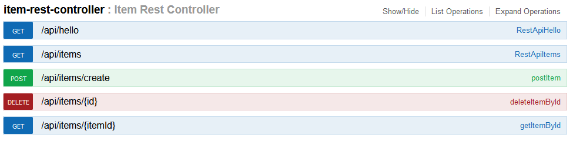

# Warehouse 

This step by step projct  we build Spring Boot application.
adding security and  deploy to heroku 

### Thymeleaf FE
[warehouse koby5i-spring-boot-intro-wh.herokuapp.com](https://koby5i-spring-boot-intro-wh.herokuapp.com)
 

### Angular FE

[bobkoby5i.github.io/intro-angular](https://bobkoby5i.github.io/intro-angular)

## Java Spring boot application 

* Spring Boot 
* JPA
* gradle
* PostgreSQL
* MySQL
* Heroku PostgreSQL
* Docker
* Docker-compose (application and postgresql in containers)
* Swagger
* Thymeleaf frontend
* Security authentication users & roles in memory 
* Security authorization
* Auth database with users and roles 
  * connecting using jdbc, 
  * connecting using JPA
* Feign
* Heroku deploy
* integration with Angular FE (separate project)
  * cores
  * csrf
  * referer

## High level components

## REST API

### Branches:

#### wh01-basic-jpa
#### wh02-dataloader
#### wh03-RESTController
#### wh04-docker-start
#### wh05-add-swagger
#### wh06-docker-compose
#### wh09-REST-POST-PUT
#### wh10-thymeleaf
#### wh11-security-basic
#### wh12-security-basic-roles
#### wh13-security-users-table
#### wh14-security-users-table-JPA
#### wh15-cors-when-accessing-api
#### wh16-JASYP_property_encryption
#### wh17-API-POST-cors
#### wh18-Heroku-deploy_from_github_repo
